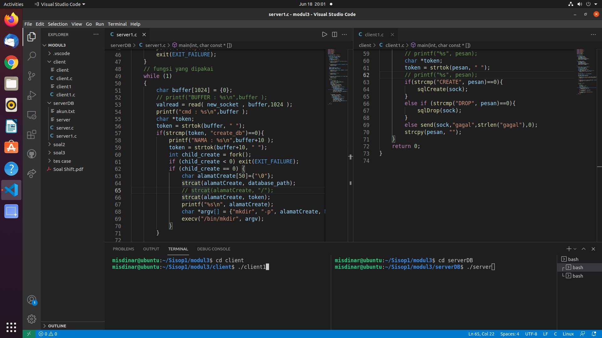
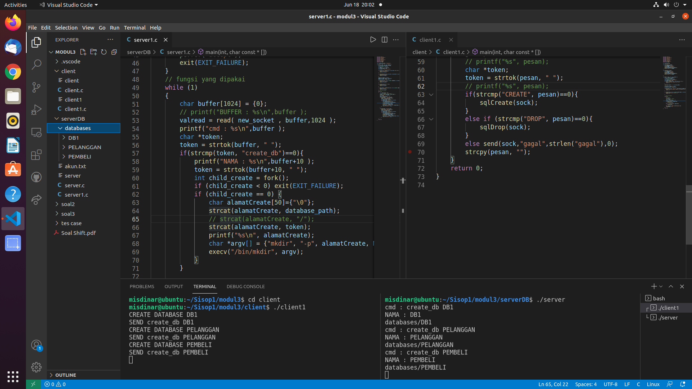
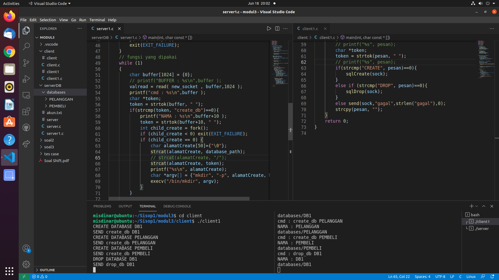
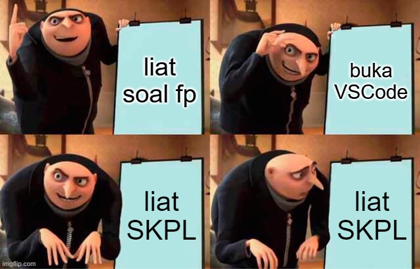

# fp-sisop-F04-2021

# Anggota Kelompok
- **Thomas Dwi Awaka** (05111940000021)
- **Muhammad Arifiansyah** (05111940000027)
- **Muhammad Rizqullah Akbar** (05111940000178)
# Pembahasan Soal
## Data Definition Language
Input penamaan database, tabel, dan kolom hanya angka dan huruf.
Semua user bisa membuat database, otomatis user tersebut memiliki permission untuk database tersebut.

### CREATE DATABASE
#### server_database
```c
char *token;
token = strtok(buffer, " ");
if(strcmp(token, "create_db")==0){
            printf("NAMA : %s\n",buffer+10 );
            token = strtok(buffer+10, " ");
            int child_create = fork();
            if (child_create < 0) exit(EXIT_FAILURE);
            if (child_create == 0) {
                char alamatCreate[50]={"\0"};
                strcat(alamatCreate, database_path);
                // strcat(alamatCreate, "/");
                strcat(alamatCreate, token);
                printf("%s\n", alamatCreate);
                char *argv[] = {"mkdir", "-p", alamatCreate, NULL};
                execv("/bin/mkdir", argv);
            }
        }
```
Setelah pesan diterima oleh server di client ,pesan dipotong menjadi _substring_ menggunakan `strtok(buffer, " ")` untuk kemudian disimpan di `token` . Kemudian di cek menggunakan `if(strcmp(token, "create_db")==0)` apabila sesuai maka pertama-tama nama database disimpan menggunakan `token = strtok(buffer+10, " ");` kemudian dilakukan  _spawning process_ dengan `fork` dimana `char alamatCreate[50]={"\0"}` diisi dengan 2 string yang akan menjadi bagian dari substring `alamatCreate` yakni `database_path` dan `token` dengan `strcat()` kemudian dijalankan progam membuat directory database baru dengan _path_ dari `alamatCreate` dengan fungsi `execv("/bin/mkdir", argv)`
#### client_database
```c
while(1){
        
        gets(pesan);
        // printf("%s", pesan);
        char *token;
        token = strtok(pesan, " ");
        // printf("%s", pesan);
        if(strcmp("CREATE", pesan)==0){
            sqlCreate(sock);
        }
        else if (strcmp("DROP", pesan)==0){
            sqlDrop(sock);
        }
        else send(sock,"gagal",strlen("gagal"),0);
        strcpy(pesan, "");
    }
```
Pertama client diminta untuk menginput command yang akan dijalankan pada server,kemudian dengan `token = strtok(pesan, " ");` pesan diambil _substringnya_ untuk di cek isi pesannya, apabila setelah di cek menggunakan `strcmp("CREATE", pesan)==0`/ isi pesan mengandung kata _CREATE_ maka akan memanggil prosedur `sqlCreate(sock)` 
```c
void sqlCreate(int sock){
    char namaDB[50]={"\0"};
    strcat(namaDB,"create_db");
    strcat(namaDB, pesan+15);
    send(sock,namaDB,strlen(namaDB),0);
    printf("SEND %s\n",namaDB);
}
```
Pada prosedur `void sqlCreate(int sock)` dengan menggunakan `strcat(namaDB,"create_db")` , `namaDB` di isi dengan 2 _substring_ yankni `create_db` dan `pesan+15` yang kemudian `namaDB` akan berisi create_db namaDB yang akan dikirim ke server
### DROP DATABASE
#### server_database
```c
char *token;
token = strtok(buffer, " ");
```
```c
  if(strcmp(token, "drop_db")==0){
            printf("NAMA : %s\n",buffer+8 );
            token = strtok(buffer+8, " ");
            int child_create = fork();
            if (child_create < 0) exit(EXIT_FAILURE);
            if (child_create == 0) {
                char alamatCreate[50]={"\0"};
                strcat(alamatCreate, database_path);
                strcat(alamatCreate, token);
                printf("%s\n", alamatCreate);
                char *argv[] = {"rmdir", alamatCreate, NULL};
                execv("/bin/rmdir", argv);
            }
        }
```
Setelah pesan diterima oleh server di client ,pesan dipotong menjadi _substring_ menggunakan `strtok(buffer, " ")` untuk kemudian disimpan di `token` . Kemudian di cek menggunakan `if(strcmp(token, "drop_db")==0)` apabila sesuai maka pertama-tama nama database disimpan menggunakan `token = strtok(buffer+8, " ");` kemudian dilakukan  _spawning process_ dengan `fork` dimana `char alamatCreate[50]={"\0"}` diisi dengan 2 string yang akan menjadi bagian dari substring `alamatCreate` yakni `database_path` dan `token` dengan `strcat()` kemudian dijalankan progam menghapus directory database dengan _path_ dari `alamatCreate` dengan fungsi `execv("/bin/rmdir", argv)`
#### client_database
```c
while(1){
        
        gets(pesan);
        // printf("%s", pesan);
        char *token;
        token = strtok(pesan, " ");
        // printf("%s", pesan);
        if(strcmp("CREATE", pesan)==0){
            sqlCreate(sock);
        }
        else if (strcmp("DROP", pesan)==0){
            sqlDrop(sock);
        }
        else send(sock,"gagal",strlen("gagal"),0);
        strcpy(pesan, "");
    }
```
Pertama client diminta untuk menginput command yang akan dijalankan pada server,kemudian dengan `token = strtok(pesan, " ");` pesan diambil _substringnya_ untuk di cek isi pesannya, apabila setelah di cek menggunakan `strcmp("DROP", pesan)==0`/ isi pesan mengandung kata _DROP_ maka akan memanggil prosedur `sqlDrop(sock)` 
```c
void sqlDrop(int sock){
    char namaDB[50]={"\0"};
    strcat(namaDB,"drop_db");
    strcat(namaDB, pesan+13);
    send(sock,namaDB,strlen(namaDB),0);
    printf("SEND %s\n",namaDB);
    
}
```
Pada prosedur `void sqlDrop(int sock)` dengan menggunakan `strcat(namaDB,"drop_db")` , `namaDB` di isi dengan 2 _substring_ yankni `create_db` dan `pesan+13` yang kemudian `namaDB` akan berisi drop_db namaDB yang akan dikirim ke server


### Screenshot
Awal


Setelah CREATE


setelah DROP


### Kendala
Tidak Tahu Harus berbuat apa~


